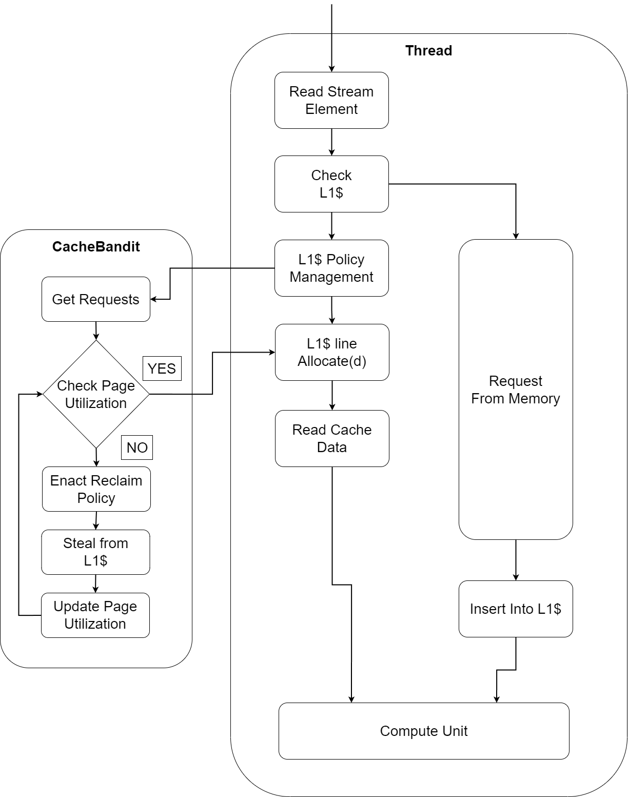
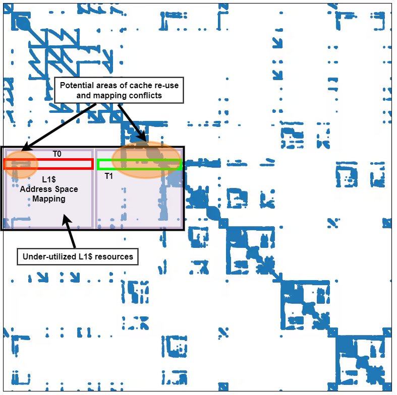
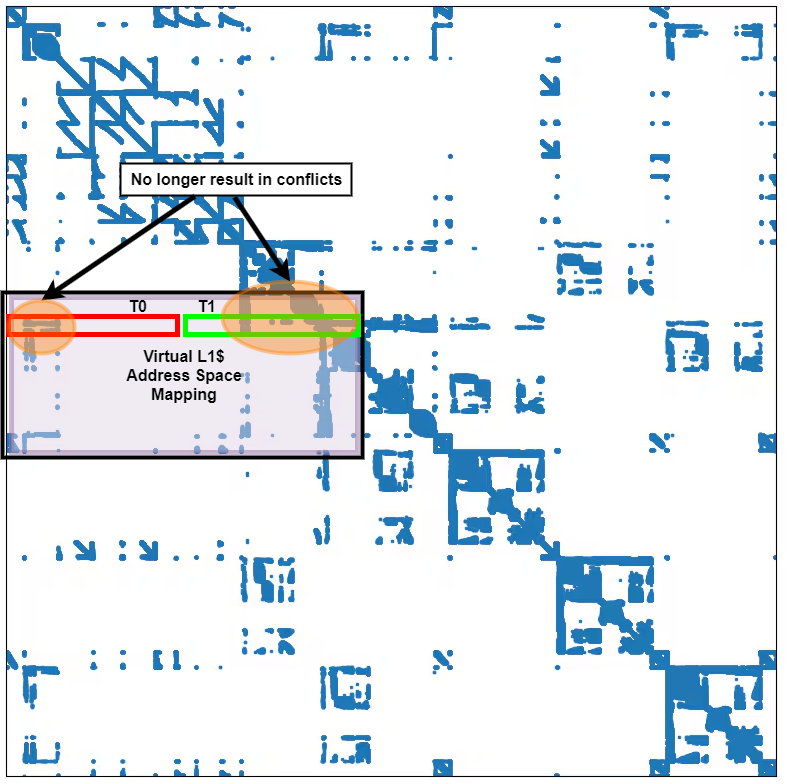
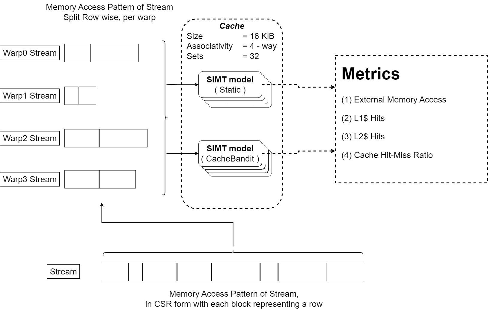
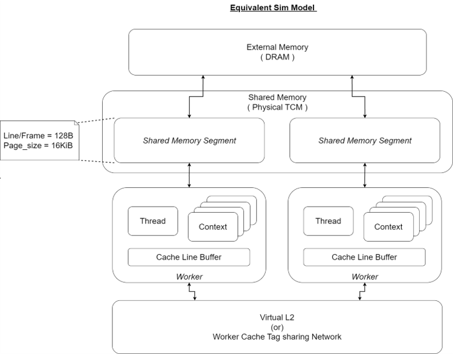

# CacheBandit
Dynamic Segmented Cache framework for SIMT/streaming applications, to elicit performance by alleviating cache conflict misses.

## Introduction
**CacheBandit** (CB) is a dynamic Tightly-Coupled-Memory (TCM) framework primarily targeting *SparseMatrix* (SpM) accelerators. The main design goals
include tile-ability and scalability, through a modular design for easy deployment and integration with SIMT/streaming architectures.
CacheBandit builds on [QPL](https://github.com/rutham5fo/QuickPageLite) to realize a global replacement policy (LRU + Random) and hashing using 
the *inverse-butterfly* shuffle network.

 \
Figure 1.: Visualization of how CacheBandit integrates with a streaming thread to provide a larger *Field-of-View* (FOV).

 \
Figure 2.: FOV of a worker (warp) on a SparseMatrix. The purple region is the physical size of the L1$ segment allocated to the worker running two
threads (TDM'ed). The orange region marks the potential areas of cache conflicts. Image taken from [gpuopen](https://gpuopen.com/learn/amd-lab-notes/amd-lab-notes-spmv-docs-spmv_part1/).

 \
Figure 3.: *Virtual* FOV of a worker on s SpM. The purple region is much larger than the physical size of allocated cache segment, resulting in better 
cache utilization and reduction in cache line thrashing.

## Simulation Model
CacheBandit is a **work-in-progress** and so far only includes the preliminary simulation/memory-access-trace part of the design. The hardware implementation
will follow soon. The simulation is run in python using the scripts described in [Setup](#setup) and shown below are the visualization of memory trace 
generation of SpM from the **SuitSparse-Matrix-Collection** and the simulation block diagram, in figures 4 and 5, respectively.

 \
Figure 4.: Simulation *CSR* trace generation and feeding into baseline model running only LRU (SIMT static) and model running with cacheBandit.

 \
Figure 5.: Equivalent simulation block diagram of cacheBandit's python script.

## Setup
cacheBandit
├───docs
├───imgs
└───sims
    ├───context
    ├───logs
    └───spmat
	
(1) Run [suitsparse.py](sims/stream_gen.py) with appropriate SpM names to download SpMs from the *SuitSparse-Matrix-Collection* into the [spmat](sims/spmat) directory.
(2) Run [stream_gen.py](sims/stream_gen.py) to generate CSR streams, *'streamA'* for single worker test, and *'interleavedA'* for multi-worker tests. Generated streams 
are placed in the [context](sims/context) folder.
(3) Run [cacheBandit.py](sims/cacheBandit.py) after setting the appropriate simulation control parameters to obtain logs for corresponding SpM traces. The logs are 
placed in [logs](sims/logs) folder.

### Simulation Control Knobs
| Knob                           		| Description                                                                   	| Script								|
| :------------------------------------ | :---------------------------------------------------------------------------------| :-------------------------------------|
| bytes_per_word               			| Number of bytes in a word.														| [stream_gen.py](sims/stream_gen.py)	|
| bytes_per_line             			| Number of bytes stored in a cache line/frame.               						| [stream_gen.py](sims/stream_gen.py)	|
| shmem_line  							| Number of words per cache line. Copy from [stream_gen.py](sims/stream_gen.py).	| [cacheBandit.py](sims/cacheBandit.py) |
| shmem_assoc							| Associativity of physical segment in TCM$.										| [cacheBandit.py](sims/cacheBandit.py) |
| shmem_sets							| Sets in physical segment of TCM$.													| [cacheBandit.py](sims/cacheBandit.py) |
| page_size								| Page size (solution space) managed by cacheBandit.								| [cacheBandit.py](sims/cacheBandit.py) |
| workers								| Number of warps each having its own TCM$ segment of size=shmem_assoc\*shmem_sets.	| [cacheBandit.py](sims/cacheBandit.py) |
| contexts								| Number of TDM'ed contexts running in a warp. Translates cacheBandit IPC.			| [cacheBandit.py](sims/cacheBandit.py) |
| ext_mem_access_penalty				| Cycle penalty incured on cache-miss. Used in metrics computation.					| [cacheBandit.py](sims/cacheBandit.py) |
| vsets									| Virtual sets seen by the warp. Controls the FOV of a warp (FOV=vsets/shmem_sets).	| [cacheBandit.py](sims/cacheBandit.py) |

## Simulation Results

Simulation results can be found in [metrics](docs/cacheBandit_metrics.xlsx). Shown in figure 6 is the result for a group of sparse matrices from the suitsparse collection.

 \
Figure 6.: Total DRAM access reduction due to cacheBandit, across various SpM from the suitsparse collection.

**P.S.: Work-In-Progress, will be updated as it is built :) . In the meantime, check out this [powerpoint](docs/CacheBandit_ppt.pptx) for more information.** \
